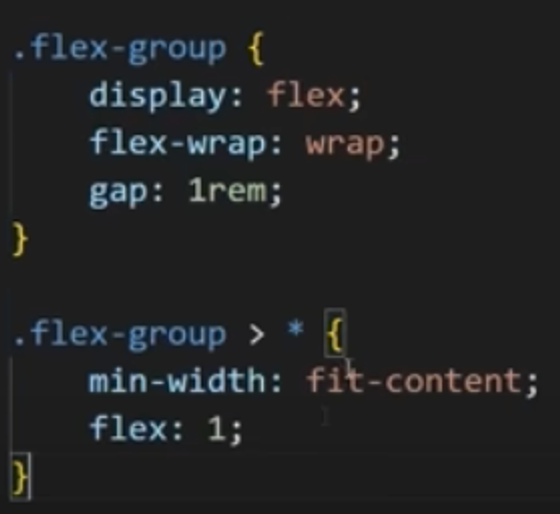

- (Flexbox trick → Allow for proper element resizing)[https://www.youtube.com/watch?v=3ugXM3ZDUuE]
    - 

- Span v Div Elements: [https://stackoverflow.com/questions/183532/what-is-the-difference-between-html-div-and-span-elements]
    * div = block element, span = inline element
        - div (flow content) to be used to wrap sections of document
        - spans (phrasing content) to be used to wrap small portions of text, images, etc.
            *   ```html
                <div>
                    Large main division with a
                        <span>
                            small subsection
                        </span>
                        of spanned text!
                </div>
                ```

        - example
            * ```html
                <div id="header">
                    <div id="userbar">
                        Hi there, <span class="username">Chris Marasti-Georg</span> |
                        <a href="/edit-profile.html">Profile
                        </a> |
                        <a href="https://www.bowlsk.com/_ah/logout?...">Sign out</a>
                    </div>
                    <h1>
                        <a href="/">Bowl
                            <span class="sk">SK</span>
                        </a>
                    </h1>
                </div>
            - 
            - explanation: header section (section - use div with 'header' id) -> user and page title sections
                * title uses h1 appropriate tag
                * userbar wrapped in div -> then username in span for style changes (2 letters in title wrapped by span)


- CSS Selectors: [https://developer.mozilla.org/en-US/docs/Learn/CSS/Building_blocks/Selectors]
